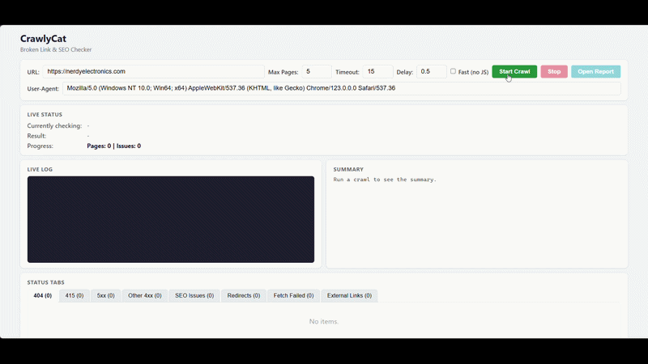
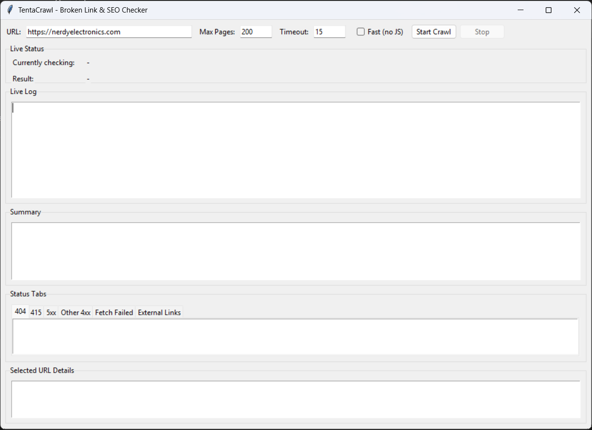
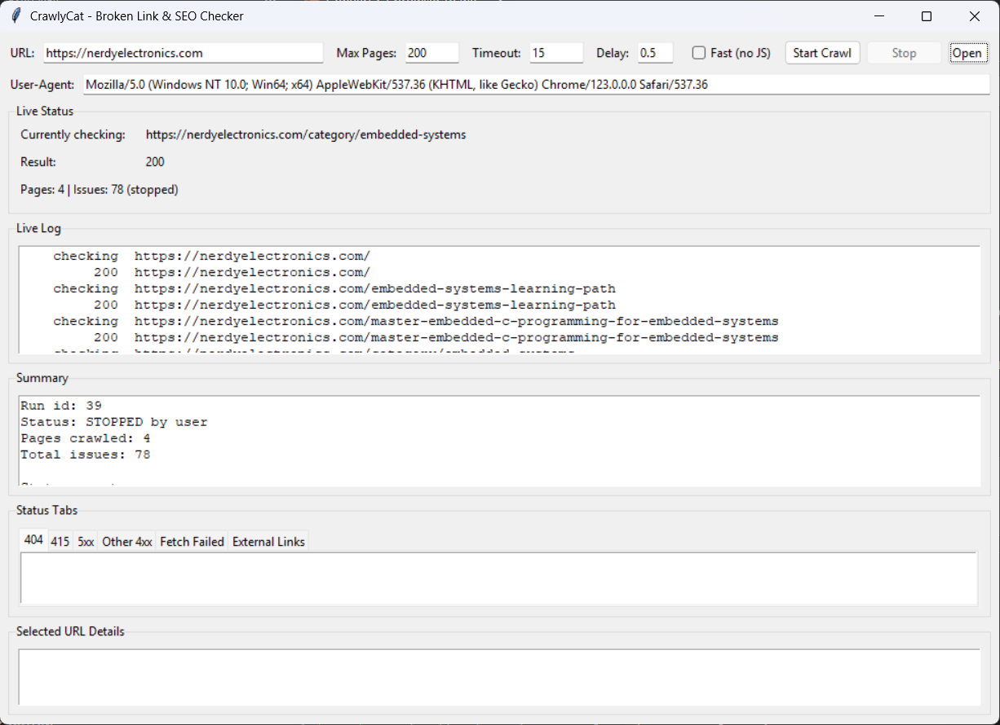

# CrawlyCat 🐱

⚡ Crawl any website and instantly find broken links, errors, and SEO issues — locally, no SaaS.

👉 Built for developers who want fast, no-BS site audits.




## Why CrawlyCat?

| | CrawlyCat | Screaming Frog | SaaS crawlers |
|---|---|---|---|
| Runs locally | ✅ | ✅ | ❌ |
| No page limits | ✅ | ❌ (500 free) | ❌ (credits) |
| JS-heavy sites (Playwright) | ✅ | ✅ | Varies |
| CLI + GUI + Web UI | ✅ | ❌ | ❌ |
| Open source | ✅ | ❌ | ❌ |
| Simple setup | ✅ | ❌ | ✅ |
| Handles Cloudflare | ✅ | ❌ | ❌ |

If Screaming Frog feels heavy or restrictive, CrawlyCat is a lightweight, developer-friendly alternative. No enterprise complexity, no credits, no limits.

## What it finds

- `4xx` / `5xx` HTTP status errors
- Redirect chains
- Missing or malformed title and meta descriptions
- Missing or multiple `<h1>` tags
- Internal broken link references
- External links (noted, not crawled)

## Features

- **Browser mode** (default) — headless Chromium via Playwright; handles JavaScript-rendered pages and bypasses Cloudflare/bot-protection challenges
- **Fast mode** — raw HTTP requests via httpx; ~10x faster for static sites
- **Web UI** — browser-based interface with live log, status tabs, and SSE updates (Flask, no npm/node required)
- **GUI** — tkinter desktop app with live progress, status tabs, stop button, and one-click HTML report
- **CLI** for scripting, CI pipelines, and scheduled runs
- Configurable rate limiting, timeout, and custom User-Agent
- Respects `robots.txt` automatically
- CSV, HTML, and SQLite report output

## Quick start

### Linux / macOS

```bash
git clone https://github.com/bhageria/crawlycat.git
cd crawlycat
python3 -m venv .venv
source .venv/bin/activate
pip install --upgrade pip
pip install -r requirements.txt
python -m playwright install chromium
```

### Windows PowerShell

```powershell
git clone https://github.com/bhageria/crawlycat.git
cd crawlycat
python -m venv .venv
.\.venv\Scripts\Activate.ps1
python -m pip install --upgrade pip
pip install -r requirements.txt
python -m playwright install chromium
```

## Usage

### Web UI

```bash
python -m crawler web
```

Opens your browser at `http://127.0.0.1:5000` with a full-featured interface: live log, status tabs, summary panel, and start/stop controls.

### GUI (desktop)

```bash
python -m crawler gui
```

### CLI

```bash
python -m crawler --url https://example.com --max-pages 200 --html-out report.html
```

## More screenshots

**GUI — launch screen**



**GUI — crawl in progress**



## Clean repo policy

Generated data is not tracked in git:
- `issues.csv`
- `sample_issues.csv`
- `crawl_history.db`
- `sample_crawl_history.db`

See `.gitignore` for full ignore rules.

Full crawler docs: `CRAWLER_README.md`

## License

This project is licensed under the [GNU General Public License v3.0](LICENSE).

## Disclaimer

This project is provided as-is, with no warranties and no liability accepted by the author or contributors. See `DISCLAIMER.md`.

## Contributing

Bug fixes, issue reports, and feature extensions are welcome. See `CONTRIBUTING.md`.
